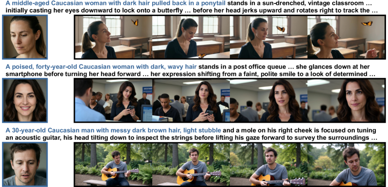
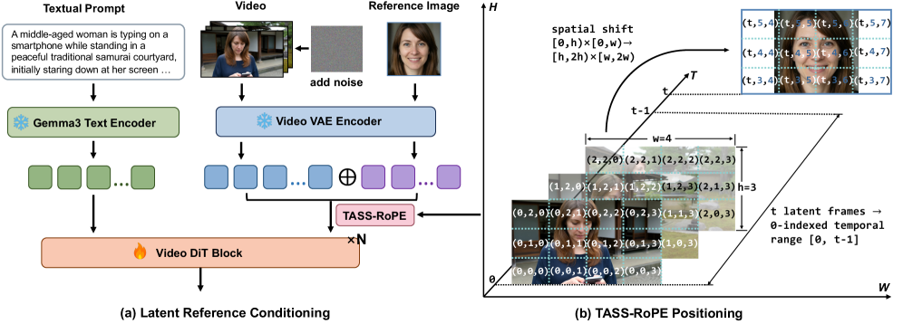

<div align="center">


<h1>Spatial-Temporal Decoupled Reference Conditioning for Identity-Preserving Text-to-Video Generation</h1>

<p>
  Yuheng Chen<sup>1,*</sup> &nbsp;
  Teng Hu<sup>1,*</sup> &nbsp;
  Yuji Wang<sup>1,*</sup> &nbsp;
  Qingdong He<sup>2</sup> &nbsp;
  Lizhuang Ma<sup>1,&dagger;</sup> &nbsp;
  Jiangning Zhang<sup>3,&Dagger;</sup>
</p>

<p>
  <sup>1</sup>Shanghai Jiao Tong University &nbsp;&nbsp;
  <sup>2</sup>University of Electronic Science and Technology of China &nbsp;&nbsp;
  <sup>3</sup>Zhejiang University
</p>

<p>
  <sup>*</sup>Equal contribution &nbsp;&nbsp;
  <sup>&dagger;</sup>Corresponding author &nbsp;&nbsp;
  <sup>&Dagger;</sup>Project lead
</p>

<div align="center">
  <a href="https://aliothchen.github.io/projects/ST-DRC/"></a> &ensp;
  <a href="https://arxiv.org/abs/2606.02441v1"></a> &ensp;
  <a href="https://arxiv.org/pdf/2606.02441v1"></a> &ensp;
  <a href="https://arxiv.org/html/2606.02441v1"></a>
</div>

</div>

---

## ✨ Introduction

ST-DRC is a spatial-temporal decoupled reference conditioning framework for identity-preserving text-to-video generation. Given a reference face and a textual prompt, the goal is to synthesize a high-fidelity video that follows the requested action, scene, and temporal dynamics while preserving the reference identity across frames.

The core idea is to treat the reference image as a latent in-context identity memory: ST-DRC encodes the reference image with the video VAE and concatenates it with noisy video latents, allowing the diffusion transformer to access fine-grained identity cues through its native spatio-temporal attention. To reduce appearance copy-paste from the reference image, ST-DRC introduces Temporal-Adjacent Spatial-Shifted RoPE (TASS-RoPE), reference-robust identity enhancement, and decoupled text-reference guidance for controllable inference.

## 🔥 Highlights

| Component | Purpose |
| --- | --- |
| Latent in-context reference injection | Provides low-level identity details without extra identity adapters. |
| TASS-RoPE | Keeps reference tokens temporally accessible while spatially shifting them to suppress pixel-level copying. |
| Reference-robust identity enhancement | Uses appearance-invariant reference augmentation and face-guided identity objectives. |
| Decoupled text-reference guidance | Independently controls prompt adherence and reference fidelity at inference time. |

## 🎬 Visual Showcase

<p align="center">
  
</p>

## 🧠 Method Overview

<p align="center">
  
</p>

## 📢 News

- 2026-06-01: Paper released on arXiv.

## 🗓️ Timeline

- [x] Release paper
- [x] Release project page
- [ ] Release inference code
- [ ] Release model checkpoint
- [ ] Release training code

## 🚀 Getting Started

The inference code, model checkpoints, and training code will be released in this repository. Please follow the timeline above for release status.

## 🙏 Acknowledgements

We gratefully thank the authors of [Lightricks/LTX-2](https://github.com/Lightricks/LTX-2#) for their excellent open-source codebase.

## 📚 Citation

If you find this work useful for your research, please consider citing:

```bibtex
@article{chen2026spatial,
  title={Spatial-Temporal Decoupled Reference Conditioning for Identity-Preserving Text-to-Video Generation},
  author={Chen, Yuheng and Hu, Teng and Wang, Yuji and He, Qingdong and Ma, Lizhuang and Zhang, Jiangning},
  journal={arXiv preprint arXiv:2606.02441},
  year={2026}
}
```
